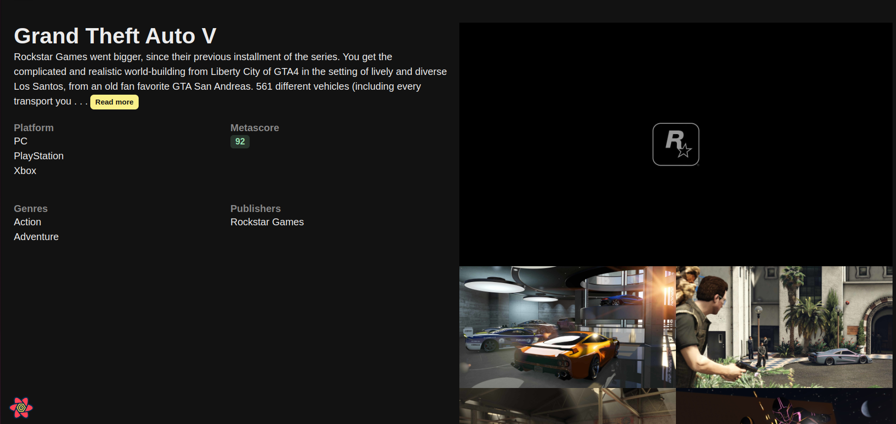

## Video Game Ocean

A simple responsive web application built using ReactJS to showcase games from [https://rawg.io/](rawg.io).

API queries handled using `axios`

Implemented features:

- Search games
- Sort games based on fields such as:
  - date
  - name
  - genre
- Filter games based on fields such as:
  - genre
  - platform
  - name
  - rating
  - popularity
  - date
- Detailed view of a game

### Preview

#### Dashboard

#### Detailed view

### Instructions to run locally

1. Clone the repository
2. `cd video-game-ocean`
3. `npm run dev`
4. Open `localhost:5173` in your browser

---

References:

- [React course 1](https://codewithmosh.com/p/ultimate-react-part1) by Mosh Hamedani

- [React course 1](https://codewithmosh.com/p/ultimate-react-part2) by Mosh Hamedani
